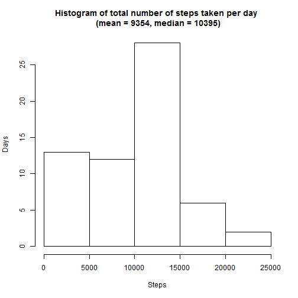
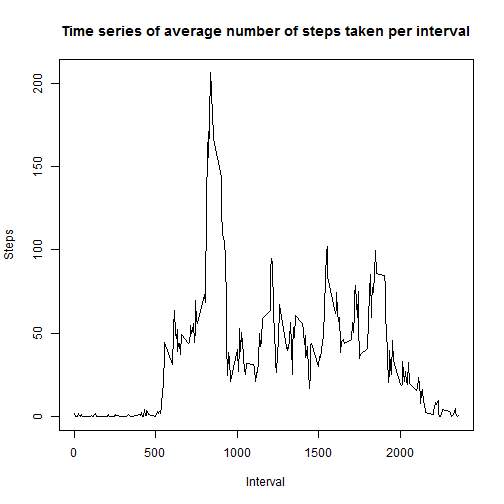
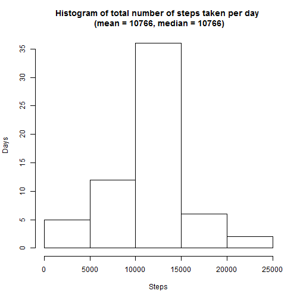
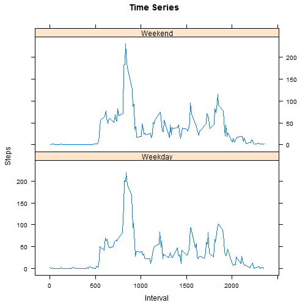

##Introduction

It is now possible to collect a large amount of data about personal movement using activity monitoring devices such as a Fitbit, Nike Fuelband, or Jawbone Up. These type of devices are part of the "quantified self" movement - a group of enthusiasts who take measurements about themselves regularly to improve their health, to find patterns in their behavior, or because they are tech geeks. But these data remain under-utilized both because the raw data are hard to obtain and there is a lack of statistical methods and software for processing and interpreting the data.

This assignment makes use of data from a personal activity monitoring device. This device collects data at 5 minute intervals through out the day. The data consists of two months of data from an anonymous individual collected during the months of October and November, 2012 and include the number of steps taken in 5 minute intervals each day.


##Part 1: Loading the data

The following code is used to set the working directory and load the data set and libraries used.


```r
library(lattice)
setwd("C:/Users/Marcello/Desktop/Coursera/Reproducible Research/repdata-data-activity")
activity = read.csv("activity.csv")
```


##Part 2: Initial data exploration

Here we're getting an idea of how the data looks. We will ignore any missing values and make a histogram of the total number of steps taken each day.


```r
total_steps = tapply(activity$steps, activity$date, sum, na.rm = TRUE)
ts_mean = as.integer(mean(total_steps))
ts_median = as.integer(median(total_steps))
hist(total_steps, main =paste0("Histogram of total number of steps taken per day \n (mean = ", ts_mean, ", median = ", ts_median,")"), xlab = "Steps", ylab = "Days")
```

 

Some summary statistics of the initial data exploration.

- Mean: 9354
- Median: 10395


##Part 3: Patterns in the data

Next we're going to make a time series plot to see if there are any daily patterns in the data. The plot will show the average steps taken across the 5-minute intervals the set of days.


```r
avg_steps_overint = tapply(activity$steps, activity$interval, mean, na.rm = TRUE)
max_steps = max(avg_steps_overint)
max_steps_interval = names(avg_steps_overint[max_steps])
plot(x = names(avg_steps_overint), y = avg_steps_overint, type = "l", main = "Time series of average number of steps taken per interval", xlab = "Interval", ylab = "Steps")
```

 

We see that the intveral with the highest number of average steps, at about 206, occurs toward the middle of the day at about 28 o'clock.


##Part 4: Caring for missing values

There are a number of days and intervals where the pedometer has no recordings, which is different from recording no steps taken. In an attempt to better understand days and times when the pedometer was "not functional", we're going to fill in the gaps with some summary statistics.


###Impact of missing data

The following gives us some insight on how much data is missing.


```r
total_missing = sum(as.integer(is.na(activity$steps)))
total_observed = nrow(activity)
##percent_observed = as.integer((1 - total_missing / total_observed) * 100)
```

We're missing 2304 observations out of a total number of 17568, which means that approximately 86% of interval observations were not missing.


###Filling in the gaps
In order to account for the approximately 14% observations, we're going to replace each missing observation with the average steps per interval as calculated in the previous section.


####Example

The following is a subset of missing values, for interval 225. In this case the value for steps, currently "NA", will be replaced with the average steps over the interval: 0.1321.


```
##       steps       date interval
## 30       NA 2012-10-01      225
## 2046     NA 2012-10-08      225
## 8958     NA 2012-11-01      225
## 9822     NA 2012-11-04      225
## 11262    NA 2012-11-09      225
## 11550    NA 2012-11-10      225
## 12702    NA 2012-11-14      225
## 17310    NA 2012-11-30      225
```

The code chunk for creating the new data set is as follows.


```r
activity_new = activity
for (i in seq_along(avg_steps_overint)) {

     activity_new[is.na(activity_new$steps) & activity_new$interval==names(avg_steps_overint)[i], 1] = avg_steps_overint[i]
}
```

The subset now looks like this.


```
##        steps       date interval
## 30    0.1321 2012-10-01      225
## 2046  0.1321 2012-10-08      225
## 8958  0.1321 2012-11-01      225
## 9822  0.1321 2012-11-04      225
## 11262 0.1321 2012-11-09      225
## 11550 0.1321 2012-11-10      225
## 12702 0.1321 2012-11-14      225
## 17310 0.1321 2012-11-30      225
```


###New data set

Repeating our initial exploration, this time with missing values represented, we obtain the following time series.


```r
total_steps_new = tapply(activity_new$steps, activity_new$date, sum, na.rm = TRUE)
ts_mean_new = as.integer(mean(total_steps_new))
ts_median_new = as.integer(median(total_steps_new))
hist(total_steps_new, main =paste0("Histogram of total number of steps taken per day \n (mean = ", ts_mean_new, ", median = ", ts_median_new,")"), xlab = "Steps", ylab = "Days")
```

 


####Comments
Because 14% observations were missing and this set was replaced with the mean, we naturally assume that the distribution will tend to be more centered. This is precisely what occurred. The previously right tailed distribution that seems to resemble a poisson distribution, now looks much more normal, but with a high kurtosis (i.e. less variation and more distribution directly surrounding the mean).


###Part 4: Weekdays verus Weekends

We would assume that for any given day, activity level wouldn't differ significantly. But, depending on the person's line of work, could he be more active during the week or on the weekend? A comparison would give us more insight into the person: For, if he is more active on the weekend we may conclude that maybe he has a sedentary career, while if the contrary is true maybe he has a very active job and prefers to relax on the weekend.

The following panel plot gives a time series of the average number of steps across an interval, as with the previous time series, but splits activity day by "weekday" and "weekend", to give us a juxtaposed visual representation.

What follows is the code and the output.


```r
week_day = activity_new$date
levels(week_day) = weekdays(as.Date(levels(week_day), format="%Y-%m-%d"))
week_part = as.integer(as.integer(week_day) > 5)
activity_new = cbind(activity_new, weekpart = factor(x = week_part, levels = c(0, 1), labels = c("Weekday", "Weekend")))

activity_final = tapply(activity_new[, 1], activity_new[, 3:4], mean)
xyplot(activity_final[ ,1] ~ as.numeric(rownames(activity_final)) | colnames(activity_final), type = "l", main = "Time Series", xlab = "Interval", ylab = "Steps", layout=c(1,2))
```

 


###Conclusions
The graphs indicates that activity behaviour doesn't differ significantly with regard to the time of week, even considering the effects of missing values on the data set; note, per the example, that it is nearly equally as likely that data is missing on the weekend as is during the week. So, we can reasonably conclude that activity behaviour is reasonably constant regardless of "time of week", and that if the person's job is sedentary so is his leisure time and vice versa. That or he works 7 days a week, or maybe not at all! Could he be a pensioner?
